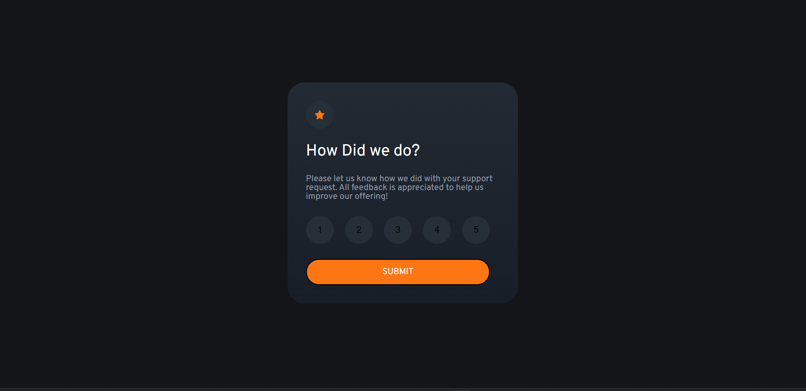
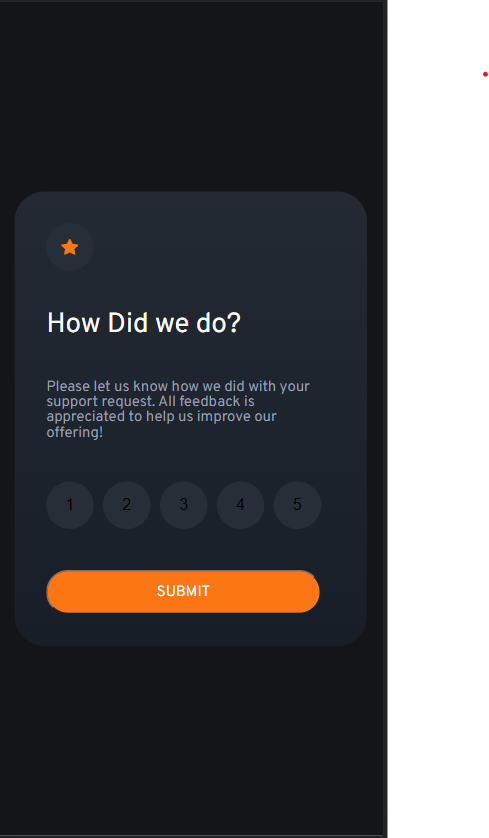

#Interactive-Rating-Component

### The challenge

Users should be able to:

- View the optimal layout for the app depending on their device's screen size
- See hover states for all interactive elements on the page
- Select and submit a number rating
- See the "Thank you" card state after submitting a rating

### ScreenShoots

### Links
- Solution URL: [code](https://github.com/batonitamazi/interactive-rating-component)
- Live Site URL: [host](interactive-rating-component-btntazo.netlify.app)

### Built with
- Semantic HTML5 markup
- CSS custom properties
- Flexbox
- Mobile-first workflow
- [React](https://reactjs.org/) - JS library
- Javascript

## Author

- Github - [Tamazi Mirianashvili](https://github.com/batonitamazi)
- Linkedin - [@Tamazi Mirianashvili](https://www.linkedin.com/in/tamazi-mirianashvili-735600210/)